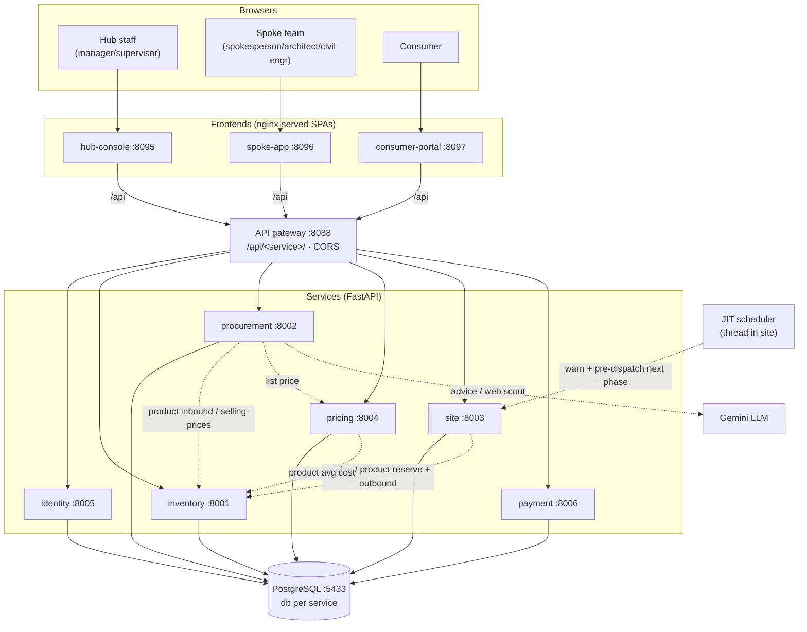
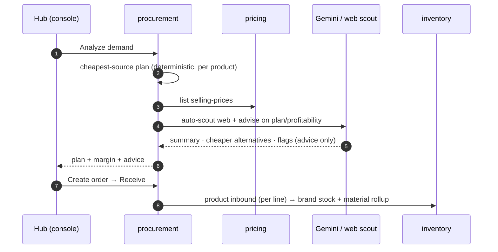
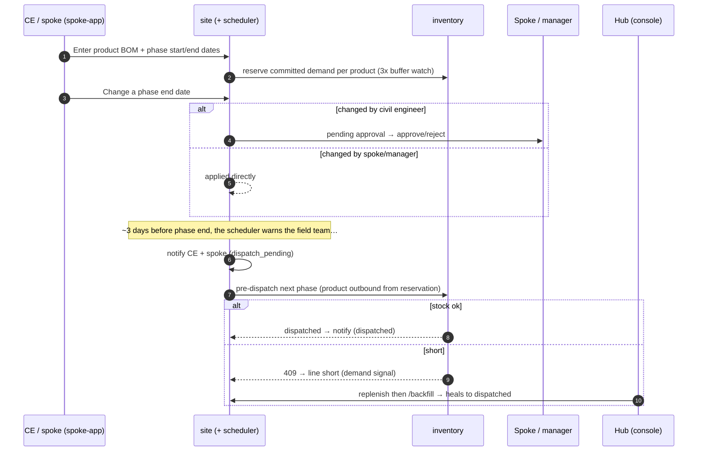
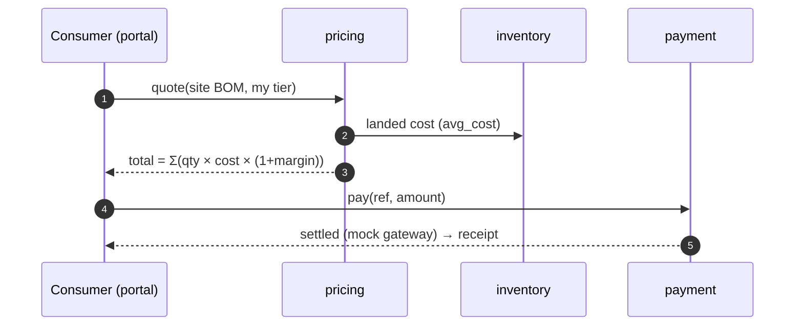

# Consmat AI V1 — High-Level Design (HLD)

> **Status:** 🟢 As-built · **Version:** 1.1 · **Model:** Hub-and-Spoke distribution
>
> This reflects the system as actually built and running. Decisions are logged in
> [DECISIONS.md](./DECISIONS.md) (D1–D22); detail is in [LLD.md](./LLD.md) and [SLD.md](./SLD.md).
>
> **v1.1 adds the full JIT site-dispatch system:** product/brand-level stock with a 3x buffer,
> CE/spoke-entered product BOMs, per-phase dates with an approval workflow, a background scheduler that
> pre-dispatches the next phase, in-app notifications, vendor add/remove approvals, and per-product margins.

---

## 1. Introduction

Consmat AI V1 is a **hub-and-spoke construction-materials distribution platform**. A central **hub**
procures, owns, prices, and dispatches material; geo-fenced **spokes** (field agents) manage retail
consumers and their construction sites; and material is delivered **just-in-time, phase by phase** as
each site progresses. The system is a set of **microservices** behind an **API gateway**, with three
role-specific React frontends.

**Core principle — deterministic money, AI assistance:** every price, quantity, stock level, margin, and
allocation is computed by deterministic services. A live LLM (Gemini) *advises* on procurement but never
sets a figure.

---

## 2. What's built (at a glance)

| Layer | Components |
|-------|-----------|
| **Ingress** | `gateway` (nginx) — single API entry, `/api/<service>/` routing, central CORS |
| **Services** | `identity` · `inventory` · `procurement` · `pricing` · `site` · `payment` (FastAPI + SQLAlchemy 2.0 + Alembic) |
| **Frontends** | `hub-console` · `spoke-app` · `consumer-portal` (React 18 + Vite + Tailwind, JWT login) |
| **Data** | one PostgreSQL, **database per service** |
| **AI** | Hub LLM = pluggable provider, running **live on Gemini** (`gemini-flash-lite-latest`) |

---

## 3. Confirmed Decisions (summary)

Full log in [DECISIONS.md](./DECISIONS.md). Foundations: **D1** hub owns inventory & prices, is also a
supplier and procures from vendors · **D2** single hub → many spokes · **D3** spokes hold no stock
(coordination role; goods ship hub → site) · **D4** 9-phase construction model drives JIT demand ·
**D5** 4-tier consumer classification · **D6** Hub LLM for procurement intelligence · **D7** persistent
DB · **D8/D9/D10** microservices, SQLAlchemy 2.0 + Alembic, database-per-service · **D11** config-driven
payments · **D12** Hub LLM on Gemini · **D13** API gateway.

v1 build-out: **D14** product/brand catalog + full-name search · **D15** procurement is tier-agnostic ·
**D16/D17** external price-scout (live web search via Tavily / Gemini grounding, advisory) · **D18**
product/brand-level stock with a **3× committed-demand buffer** · **D19** CE/spoke-entered product BOM +
per-phase start/end dates + end-date **approval workflow** · **D20** background **JIT scheduler** that
pre-dispatches the next phase + in-app **notifications** · **D21** vendor add/remove **request→approval**
(new `hub_ops` role) · **D22** **per-product margins**.

---

## 4. Architecture

> Frontend + external API traffic goes **through the gateway**. Internal service-to-service calls
> (dashed) go **directly** by service name, authenticated with a minted `service` token. The **JIT
> scheduler** is a background thread inside site-service (not a separate container).

---

## 5. Actors & Roles

| Role | App | Responsibilities |
|------|-----|------------------|
| **hub_manager** | hub-console | Pricing/margins, all approvals (vendor + phase dates), project oversight, procurement, staff — sits above the spoke |
| **hub_supervisor** | hub-console | Inventory movements, procurement runs, dispatch/receive, vendor & date approvals |
| **hub_ops** | hub-console | Operator: **requests** vendor add/remove (approved by supervisor/manager) |
| **spokesperson** | spoke-app | Geofence, consumer intake & 4-tier classification, enter/edit BOM, phase dates, approve CE date changes |
| **architect** | spoke-app | Site plans (legacy auto-BOM) |
| **civil_engineer** | spoke-app | Enter BOM, phase progress + dates (end-date changes need approval) |
| **consumer** | consumer-portal | Track own project, pay |
| **vendor** | (upstream) | Sells material to the hub |
| **admin** | any | Full override |
| *service* | — | Internal service-to-service token |

The **spoke-app** blends the three field roles into one guard set for field actions (with the
**civil-engineer end-date change** singled out for approval); the **hub-console** distinguishes operator
(request), supervisor (ops + approve), and manager (pricing + approve + oversight).

---

## 6. Service Catalog

| Service | Owns | Key API |
|---------|------|---------|
| **identity** | Users, roles, JWT issuance | `/auth/login`, `/auth/me`, `/users` |
| **inventory** | Materials + **products** catalog, material + **product-level stock**, ledger | `/materials`, `/products*`, `/inventory*`, `/product-stock*`, `/ledger` |
| **procurement** | Vendors + product price lists, **vendor requests**, planning, Hub LLM + web scout, orders | `/vendors*`, `/vendor-requests*`, `/prices/{m}`, `/procurement/*`, `/external-offers*` |
| **pricing** | Margin rules (**per product** / material / tier), selling price | `/margins`, `/price/{m}`, `/price-product/{id}`, `/quote`, `/selling-prices` |
| **site** | Spokes, consumers, sites, **product BOM**, phases + **dates/approvals**, dispatch, **scheduler**, **notifications** | `/spokes*`, `/consumers*`, `/intake`, `/sites*`, `/phase-changes*`, `/notifications*`, `/scheduler/tick`, `/backfill` |
| **payment** | Config-driven gateway, payments | `/payments*`, `/payments/config` |

Full endpoint reference in [LLD §4](./LLD.md#4-api-reference).

---

## 7. Frontends

| App | For | Pages |
|-----|-----|-------|
| **hub-console** | operator/supervisor/manager | Overview, **Projects** (all sites + date-change approvals + notifications + run-scheduler), Inventory (**per-brand stock, 3× low-stock panel, product inbound**), Vendors (**request/approve add-remove**), Procurement (+ LLM advice + web scout), Pricing (**per-product margins**), Payments |
| **spoke-app** | spokesperson/architect/civil engineer | Territory, Intake, Sites, Site detail (**enter/edit product BOM, phase start/end dates, approve CE date changes, notifications**, start/complete/backfill) |
| **consumer-portal** | consumer | Projects, phase timeline + delivery status (product names), Pay for project |

All three: JWT login, token attached to every request, 401 → logout, role shown; API reaches services
through their own nginx → the gateway.

---

## 8. Core Flows

### 8.1 Supply (procurement) — LLM-advised, product-level

### 8.2 Demand — product BOM, phase dates, JIT scheduler & self-healing backfill

### 8.3 Money — pricing & consumer payment

---

## 9. Authentication & Authorization

- **identity-service issues** JWTs (HS256) on login; claims: `sub` (email), `role`, `name`, `org_ref`.
- **Every service validates locally** with the shared `JWT_SECRET` — no call back to identity.
- **Role guards** per endpoint (reads: any authenticated; writes: role-scoped).
- **Service-to-service** calls mint a short-lived `service` token so internal flows (dispatch, receive,
  pricing) pass their targets' guards.

Detail in [LLD §5](./LLD.md#5-authentication--roles).

---

## 10. Cross-Cutting Concerns

- **Deterministic pricing** — all figures from services; the LLM only reasons over them.
- **Config-driven** — catalog/BOM coefficients seeded; payment providers in `config.yaml`; LLM + secrets in `.env`.
- **Single ingress** — the gateway centralizes API routing + CORS; a home for future rate limiting/edge auth.
- **Self-healing supply** — shortfalls are first-class signals; backfill reconciles them after replenishment.
- **Just-in-time by date** — a background scheduler pre-dispatches the next phase before the current one ends, so sites never stall waiting for material.
- **Buffer-based early warning** — the hub watches a **3× committed-demand** buffer per brand and flags low/no-stock before an actual stockout.
- **Approval workflows** — irreversible/authority-sensitive actions (vendor add-remove, civil-engineer phase-date changes) are requested by one role and approved by another.
- **Graceful AI degradation** — LLM/web-scout error/quota → deterministic fallback, no failure.

---

## 11. Non-Functional Characteristics

| Attribute | As-built |
|-----------|----------|
| Persistence | PostgreSQL, database per service; durable ledger |
| Consistency | Inventory mutations row-locked + transactional; append-only ledger |
| Auth | JWT + role guards; shared secret; service tokens for internal calls |
| Scalability | Services independent; single hub simplifies v1; horizontal scale needs shared-nothing per service (already db-per-service) |
| Security | Secrets via env (gitignored); CORS at gateway; TLS is an ops add-on |
| AI | Live Gemini (free-tier quota); deterministic fallback |

---

## 12. Status & Remaining

**Complete:** all services + auth + payments + API gateway; product/brand catalog, pricing, and stock;
web-scouted procurement; the full JIT site-dispatch system (product BOM entry, phase dates + approval,
3× buffer, background scheduler, notifications); vendor request→approval; per-product margins. Hub LLM live.

**Deferred / optional:** real payment-provider API calls (extension points in `payment-service`),
email/push delivery of notifications (in-app only in v1), and finer product questions in
[DECISIONS.md](./DECISIONS.md) (purchase-order approval thresholds, credit terms, catalog expansion).
Production hardening (TLS, secrets manager, rate limiting) is out of scope for v1.

---

*Related: [LLD.md](./LLD.md) · [SLD.md](./SLD.md) · [DECISIONS.md](./DECISIONS.md)*
