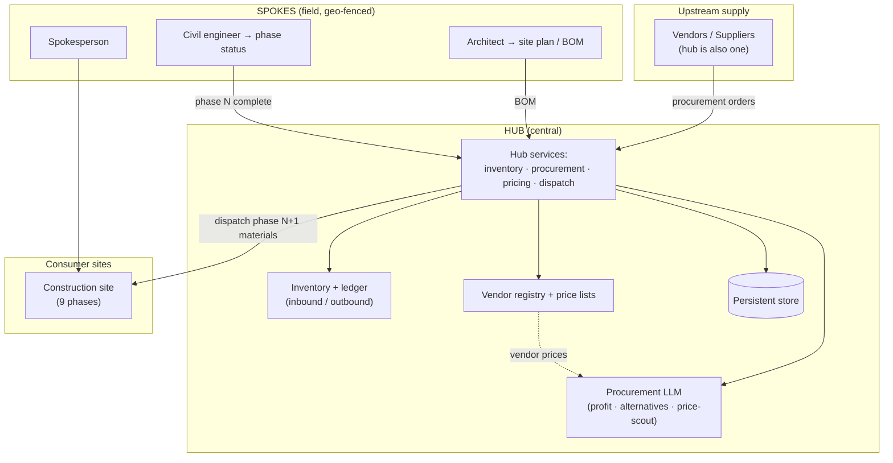
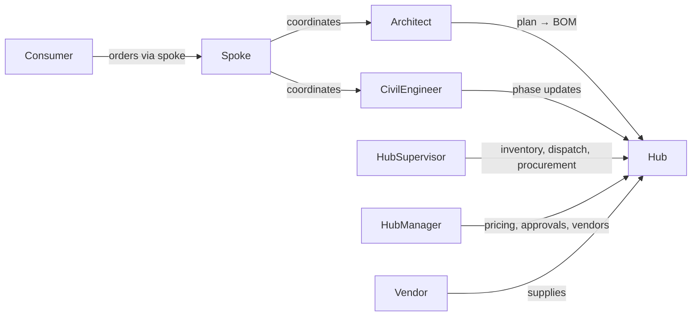
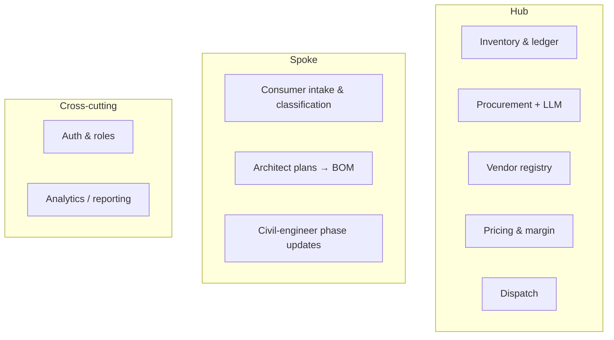
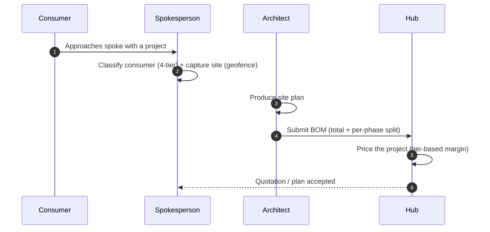
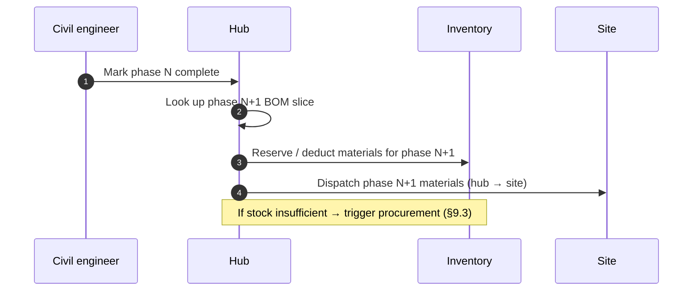
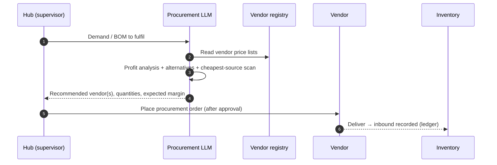

# Consmat AI V1 — High-Level Design (HLD)

> **Status:** 🟡 Design phase · **Version:** 0.1 · **Model:** Hub-and-Spoke distribution
>
> This is a clean-slate design for V1. It supersedes the earlier buyer-centric marketplace. Confirmed
> decisions are in [§2](#2-confirmed-design-decisions); open items are tracked in [DECISIONS.md](./DECISIONS.md).

---

## 1. Introduction

### 1.1 Purpose
Consmat AI V1 is a **hub-and-spoke construction-materials distribution platform**. A central **hub**
procures, owns, prices, and dispatches material; geo-fenced **spokes** (field agents) manage retail
consumers and their construction sites; and material is delivered **just-in-time, phase by phase** as
each site progresses.

### 1.2 Scope
This HLD covers the architecture, actors, components, and core flows of V1. Detailed entity/role
modelling is in [LLD.md](./LLD.md); deployment in [SLD.md](./SLD.md).

### 1.3 Key terms
| Term | Meaning |
|------|---------|
| **Hub** | The single central distribution + procurement + pricing authority; owns all inventory |
| **Spoke** | A geo-fenced *spokesperson* (field agent) — the consumer relationship & coordination layer (holds no stock) |
| **Site** | A consumer's construction project, progressing through phases |
| **Phase** | One of 9 construction stages; completing a phase triggers the next phase's material dispatch |
| **BOM** | Bill of Materials — quantities of each material a site/phase requires |
| **Procurement** | The hub buying material from vendors (or using its own supply) to replenish inventory |

---

## 2. Confirmed Design Decisions

| # | Decision | Choice |
|---|----------|--------|
| D1 | Inventory ownership & pricing | **Hub owns & resells**; hub sets the selling price; hub is itself a supplier and also procures from external vendors |
| D2 | Network topology | **Single hub → many spokes** |
| D3 | Spoke inventory | **Spoke holds no stock**; material ships **hub → site** directly; only the hub tracks inventory |
| D4 | Construction phases | **9-phase model** (see [§9.2](#92-the-9-phase-model)) drives phased JIT demand |
| D5 | Consumer classification | **4-tier**: Individual · Contractor · Commercial · Government/Institutional |
| D6 | Procurement intelligence | A **Hub LLM** analyzes BOM profitability, suggests alternatives, and price-scouts vendors |

---

## 3. System Overview

A single **hub** is the merchant of record: it holds inventory, sets prices, and fulfils sites. Around
it are many **spokes** — each a person owning a geofence, backed by an **architect** (site plans) and a
**civil engineer** (on-site execution + phase status). Consumers transact through their spoke; the
architect's plan yields a **BOM**; the civil engineer's phase updates pull material from the hub
**just-in-time**. Upstream, the hub procures from a registry of **vendors**, guided by an **LLM** that
optimizes for profit and cheapest sourcing.

```
suppliers / vendors ──► HUB (owns stock, prices, procures) ──► SPOKE (coordination) ──► SITE (consumer)
        └──────────────── LLM-assisted procurement ─────────────┘         └── phase-driven JIT demand ──┘
```

---

## 4. Architecture Principles

1. **Hub is the single source of truth for stock and price.** All inventory and pricing decisions are centralized.
2. **Spokes coordinate, they don't warehouse.** Goods flow hub → site; spokes manage relationships and site progress.
3. **Demand is phase-driven and just-in-time.** Material is dispatched per phase to avoid both stockpiling on site and delays.
4. **Deterministic money, AI assistance.** The Hub LLM advises on procurement/profit; quantities and prices are computed deterministically and remain auditable.
5. **Durable inventory.** Because the hub must track every inbound/outbound movement, V1 uses a **persistent database** (not in-memory) — see [SLD.md](./SLD.md).
6. **Role-scoped access.** Distinct roles (hub manager/supervisor, spokesperson, architect, civil engineer, consumer, vendor) with least-privilege guards.

---

## 5. High-Level Architecture



---

## 6. Actors & Roles



| Role | Tier | Responsibilities |
|------|------|------------------|
| **Consumer** | site | Owns a construction project; classified into one of 4 tiers; served through a spoke |
| **Spokesperson** | spoke | Owns a geofence; consumer intake & classification; coordinates architect + civil engineer |
| **Architect** | spoke | Produces the site plan → BOM |
| **Civil engineer** | spoke | On-site execution; updates phase status (JIT trigger) |
| **Hub supervisor** | hub | Executes inventory movements, dispatch, procurement runs |
| **Hub manager** | hub | Pricing, approvals, vendor registry, oversight |
| **Vendor / supplier** | upstream | Sells material to the hub |

> Role/permission detail and the manager-vs-supervisor split are in [LLD §4](./LLD.md#4-roles--permissions).

---

## 7. Component Overview

| Component | Responsibility |
|-----------|----------------|
| **Hub inventory service** | Stock levels + inbound/outbound ledger; valuation |
| **Procurement service** | Vendor selection, procurement orders, receiving into inventory |
| **Vendor registry** | List of vendors + price lists; add/maintain vendors |
| **Procurement LLM** | BOM profitability, alternative suggestions, cheapest-vendor price-scouting |
| **Pricing service** | Hub selling price + margin, per consumer tier |
| **Site & phase service** | Site plans, per-phase BOM, phase status, JIT dispatch triggers |
| **Dispatch service** | Hub → site delivery of each phase's materials |
| **Spoke service** | Geofence assignment, consumer relationship & classification |
| **Identity & auth** | Users, roles, tokens, guards |
| **Hub console (app)** | Supervisor + manager operations UI |
| **Spoke app** | Spokesperson + architect + civil engineer UI |
| **Consumer portal** | Consumer-facing status/orders |

---

## 8. Major Functional Modules



---

## 9. Core Flows

### 9.1 Site intake → BOM



### 9.2 The 9-phase model & phased JIT dispatch

Phases (each maps to a slice of the BOM; the RCC phase repeats per floor):

1. Excavation & footing
2. Foundation & plinth beam
3. RCC superstructure (columns/beams/slabs — repeats per floor)
4. Masonry / brickwork
5. Roofing / terrace slab
6. Internal plastering
7. External plastering
8. Flooring & tiling
9. MEP & finishing (electrical, plumbing, painting, doors/windows, fixtures)



### 9.3 Procurement with the Hub LLM



> The LLM advises; **actual prices/quantities are computed deterministically** and every inventory
> movement is ledgered.

---

## 10. Inventory Model (Hub-only)

- The **hub is the only inventory location** (D3). Every movement is recorded in an **inbound/outbound
  ledger** so stock is always reconcilable.
- **Inbound:** procurement receipts from vendors (and the hub's own supply).
- **Outbound:** phase dispatches to sites; adjustments/wastage.
- Stock valuation supports the profitability analysis the LLM performs.

Details and the ledger schema are in [LLD §5](./LLD.md#5-inventory--ledger).

---

## 11. Pricing & Margin

- The **hub sets the selling price** (D1). Retail price = landed procurement cost + margin, potentially
  differentiated by **consumer tier** (D5).
- The **Procurement LLM** flags whether a given BOM/source is profitable and suggests cheaper
  alternatives before the hub commits.
- All figures are deterministic and auditable; the LLM never fixes a price.

---

## 12. Hub LLM — Procurement Intelligence

The LLM's role moves upstream (vs the old buyer assistant). Given a BOM or demand, it:
1. Reads the **vendor registry + price lists**.
2. Computes/explains **profitability** (margin at current selling prices).
3. Suggests **alternatives** (substitute materials/grades/vendors).
4. **Price-scouts** the market for cheaper suppliers/manufacturers.

Design detail (inputs, outputs, determinism boundary) is in [LLD §7](./LLD.md#7-hub-llm--procurement-intelligence).

---

## 13. Technology Direction

Carried forward from V0 where sensible, adjusted for V1's needs:

| Layer | Direction |
|-------|-----------|
| Backend | FastAPI (Python) — service(s); boundaries TBD (modular monolith to start) |
| Persistence | **Persistent DB (e.g. Postgres)** — inventory ledger demands durability |
| LLM | Pluggable provider (OpenAI-compatible incl. Gemini), understanding/advice only |
| Auth | JWT + role guards |
| Frontends | React apps: hub console, spoke app, consumer portal |
| Packaging | Docker / Docker Compose |

> Final choices are recorded as decisions in [DECISIONS.md](./DECISIONS.md) as each step is designed.

---

## 14. Non-Functional Considerations

| Attribute | V1 intent |
|-----------|-----------|
| **Durability** | Persistent store; inventory ledger must survive restarts |
| **Auditability** | Every stock movement and price is reconstructable |
| **Consistency** | Inventory deduction/reservation must be transactional |
| **Scalability** | Single hub simplifies v1; spokes scale horizontally as data rows, not services |
| **Security** | Role-scoped access; secrets via env; vendor/consumer data protected |
| **Extensibility** | Payment, notifications, logistics as pluggable adapters |

---

## 15. Build Roadmap

1. **Domain & role model** ← current design step ([LLD.md](./LLD.md))
2. Hub inventory + ledger
3. Vendor registry + price lists
4. Procurement + Hub LLM
5. Site & phase management (plans, per-phase BOM, JIT dispatch)
6. Spoke ops (geofence, consumer intake/classification)
7. Pricing & margin
8. Frontends (hub console, spoke app, consumer portal)

---

*Related: [LLD.md](./LLD.md) · [SLD.md](./SLD.md) · [DECISIONS.md](./DECISIONS.md)*
