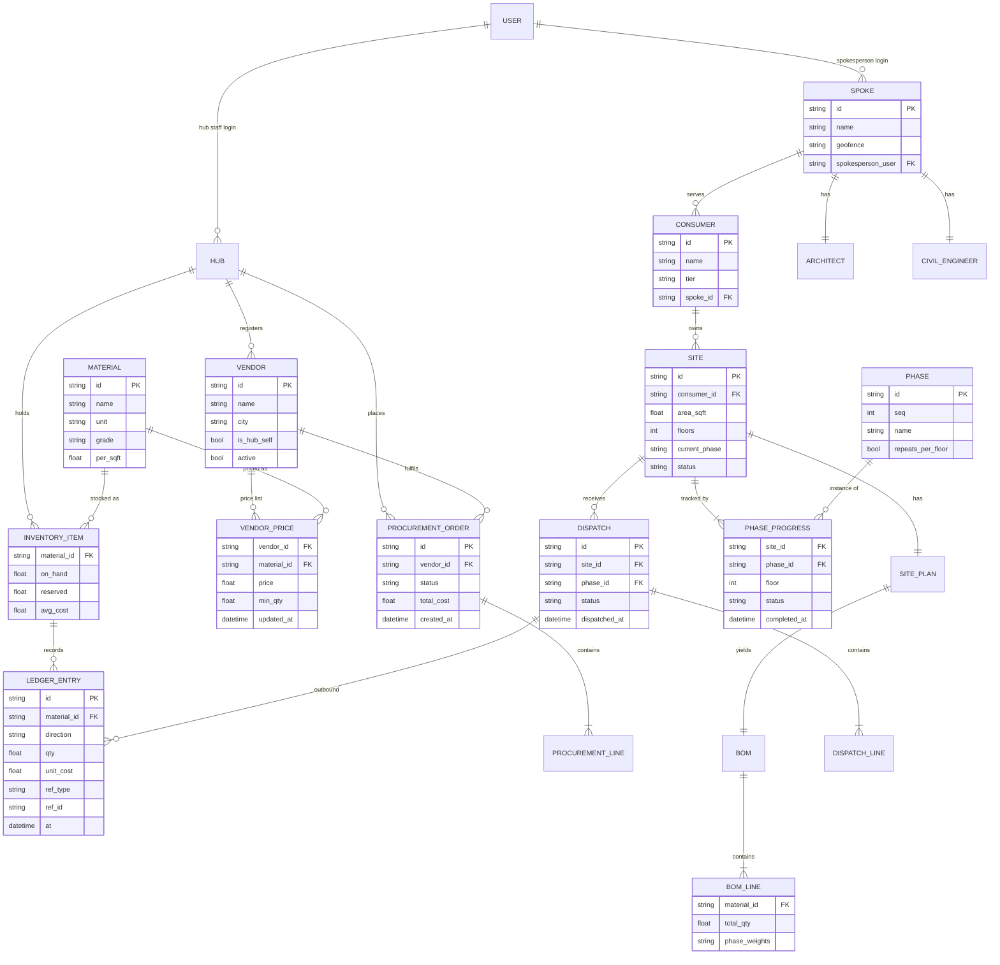
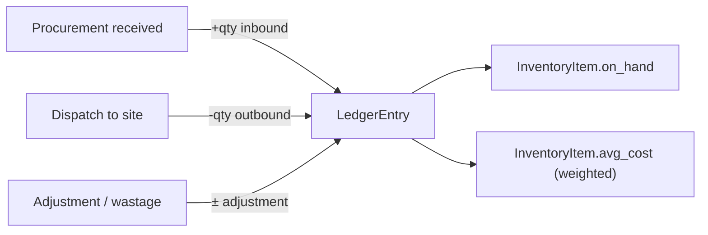
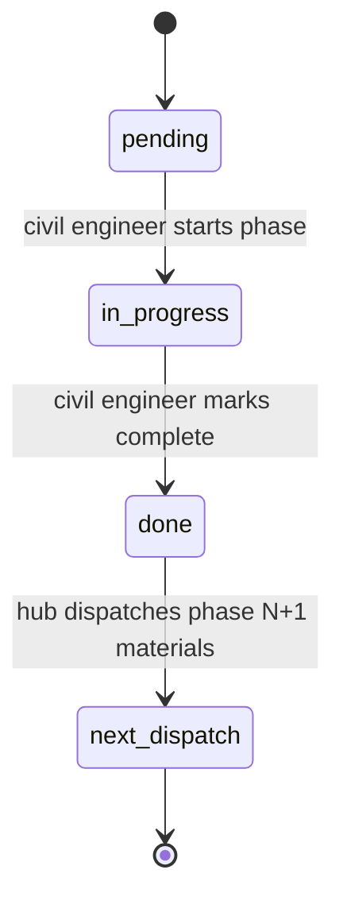

# Consmat AI V1 — Low-Level Design (LLD)

> **Status:** 🟡 Design phase · **Version:** 0.1 · **Scope of this cut:** the **domain & role model**
> (roadmap Step 1). API surface and service internals are added as later steps are designed.

This document defines the entities, relationships, roles, the 9-phase construction model, the inventory
ledger, and the Hub LLM's procurement design. See [HLD.md](./HLD.md) for architecture and
[DECISIONS.md](./DECISIONS.md) for decisions/open questions.

---

## Table of Contents
1. [Domain overview](#1-domain-overview)
2. [Entity–relationship model](#2-entityrelationship-model)
3. [Entity definitions](#3-entity-definitions)
4. [Roles & permissions](#4-roles--permissions)
5. [Inventory & ledger](#5-inventory--ledger)
6. [Sites, phases & JIT demand](#6-sites-phases--jit-demand)
7. [Hub LLM — procurement intelligence](#7-hub-llm--procurement-intelligence)
8. [Pricing & margin](#8-pricing--margin)
9. [Open design items](#9-open-design-items)

---

## 1. Domain Overview

The domain has three tiers — **upstream** (vendors), **hub** (inventory/procurement/pricing/dispatch),
and **field** (spokes, sites, consumers). The hub is the only stock-holding node. Demand originates at
sites and is satisfied phase by phase from hub inventory; the hub replenishes via procurement.

---

## 2. Entity–Relationship Model

---

## 3. Entity Definitions

### Upstream & hub
- **Material** — `id, name, category, unit, grade, per_sqft` (BOM coefficient). The 5 base materials
  (cement, TMT steel, sand, aggregate, bricks) carry from V0; extensible.
- **Vendor** — `id, name, city, phone, gstin, active, is_hub_self` (`is_hub_self=true` models the hub's
  own supply as a vendor). Registered and maintained by the hub.
- **VendorPrice** — `vendor_id, material_id, price, min_qty, updated_at` — a vendor's quoted price for a
  material (the "vendor list with their pricings"; the hub can add vendors/prices anytime).
- **InventoryItem** — per material: `on_hand, reserved, avg_cost` (weighted-average cost for valuation).
- **LedgerEntry** — immutable movement: `direction ∈ {inbound, outbound, adjustment}`, `qty, unit_cost,
  ref_type ∈ {procurement, dispatch, adjustment}, ref_id, at`.
- **ProcurementOrder** / **ProcurementLine** — hub buys from a vendor; lines are `{material_id, qty,
  unit_cost}`. Receiving posts inbound ledger entries.

### Field
- **Spoke** — `id, name, geofence, spokesperson_user`; has one **Architect** and one **CivilEngineer**.
- **Consumer** — `id, name, tier ∈ {individual, contractor, commercial, government}, spoke_id, contact`.
- **Site** — `id, consumer_id, location, area_sqft, floors, current_phase, status`.
- **SitePlan** — architect's plan for a site; yields the **BOM**.
- **BOM** / **BOMLine** — `{material_id, total_qty, phase_weights}` where `phase_weights` distributes the
  total across the 9 phases (see [§6](#6-sites-phases--jit-demand)).
- **Phase** — the 9 canonical phases; `repeats_per_floor` true for RCC superstructure.
- **PhaseProgress** — per site (and per floor where relevant): `status ∈ {pending, in_progress, done}`.
- **Dispatch** / **DispatchLine** — hub → site shipment for a phase; posts outbound ledger entries.

### Identity
- **User** — `id, email, name, role, org_ref` (`org_ref` = spoke_id for field roles, hub for hub roles,
  vendor_id for vendors). Roles in [§4](#4-roles--permissions).

---

## 4. Roles & Permissions

| Role | Scope | Can do | Cannot do |
|------|-------|--------|-----------|
| **hub_manager** | hub | Set prices/margin, approve procurement, manage vendor registry, manage hub staff, all hub reads | — |
| **hub_supervisor** | hub | Execute inventory movements, run/receive procurement, dispatch to sites | Change pricing, add/remove staff, approve high-value procurement (TBD threshold) |
| **spokesperson** | own spoke | Consumer intake & classification, manage own sites, view dispatch status | Access other spokes, hub inventory writes |
| **architect** | own spoke | Create site plans → BOM | Modify phase progress, pricing |
| **civil_engineer** | own spoke | Update phase progress (JIT trigger), site status | Create plans, pricing |
| **consumer** | own sites | View own site status, orders, quotations | Any write beyond own requests |
| **vendor** | own record | Maintain own price list, view own procurement orders | Anything hub-internal |

> The **manager vs supervisor** split (approval thresholds, which actions require manager sign-off) is an
> open item — see [DECISIONS.md](./DECISIONS.md).

---

## 5. Inventory & Ledger

The hub is the sole stock location (D3). Correctness rests on an **append-only ledger**; `on_hand` is
the ledger's running sum and can be recomputed for audit.

- **Reservation:** when a phase is scheduled, its materials are `reserved` (not yet outbound) to prevent
  double-allocation; dispatch converts reservation → outbound.
- **Valuation:** `avg_cost` updated on each inbound (weighted average) — feeds profitability analysis.
- **Transactionality:** reserve/deduct must be atomic (DB transaction) to avoid oversell.

---

## 6. Sites, Phases & JIT Demand

### 6.1 BOM derivation
Total per-material quantity follows the V0 approach: `qty = area_sqft × floors × per_sqft ×
type_multiplier`. The architect's plan may override/refine per site.

### 6.2 The 9-phase model
| Seq | Phase | Repeats/floor | Primary materials (indicative) |
|-----|-------|---------------|--------------------------------|
| 1 | Excavation & footing | no | (minimal — PCC: cement, aggregate, sand) |
| 2 | Foundation & plinth beam | no | cement, steel, sand, aggregate, some bricks |
| 3 | RCC superstructure | **yes** | cement, steel, aggregate, sand |
| 4 | Masonry / brickwork | no | bricks, cement, sand |
| 5 | Roofing / terrace slab | no | cement, steel, aggregate, sand |
| 6 | Internal plastering | no | cement, sand |
| 7 | External plastering | no | cement, sand |
| 8 | Flooring & tiling | no | cement, sand (+ tiles, out of catalog) |
| 9 | MEP & finishing | no | (minimal bulk — mostly fixtures, out of catalog) |

Each `BOMLine.phase_weights` distributes that material's total across these phases (weights sum to 1.0).
The exact coefficient matrix is **tunable** and will be pinned during Step 5 design.

### 6.3 JIT trigger

Completing phase *N* computes phase *N+1*'s material slice from the BOM, reserves/deducts it from hub
inventory, and creates a **Dispatch** (hub → site). Insufficient stock triggers **procurement**
([§7](#7-hub-llm--procurement-intelligence)).

---

## 7. Hub LLM — Procurement Intelligence

The LLM operates on the **procurement side** (successor to V0's buyer assistant). It advises; it never
sets prices or stock.

**Inputs:** a demand/BOM to fulfil, the **vendor registry + price lists**, current inventory `avg_cost`,
and the hub's selling prices.

**Outputs (structured):**
- `profitability` — expected margin if fulfilled at current selling prices.
- `alternatives` — substitute materials/grades or vendor mixes that improve margin.
- `sourcing` — cheapest vendor(s)/quantities to procure (a market/price scan).
- `recommendation` — a ranked procurement plan for hub approval.

**Determinism boundary:** the LLM ranks and explains; the actual costs, quantities, and margins are
computed by deterministic functions over vendor prices + inventory. Provider is pluggable
(OpenAI-compatible incl. Gemini), consistent with V0's `AI_PROVIDER` abstraction. On any LLM error, the
hub falls back to a deterministic cheapest-vendor selection (the V0 `split_fill` logic, relocated
upstream).

---

## 8. Pricing & Margin

- **Selling price** is set by the hub (D1); modelled as `landed_cost + margin`, with margin potentially
  keyed to **consumer tier** (D5: individual/contractor/commercial/government).
- **Landed cost** for a site dispatch = weighted-average inventory cost + hub→site logistics.
- The margin model (flat %, per-tier %, or per-material) is an **open item** — see
  [DECISIONS.md](./DECISIONS.md).

---

## 9. Open Design Items

Tracked in [DECISIONS.md](./DECISIONS.md); highlights:
- Manager vs supervisor approval thresholds.
- Exact phase→material weight matrix (Step 5).
- Margin model (flat / per-tier / per-material).
- Backend service boundaries (modular monolith vs services).
- Database choice & schema migrations (Postgres assumed).
- Whether the consumer portal is in V1 scope or later.

---

*Related: [HLD.md](./HLD.md) · [SLD.md](./SLD.md) · [DECISIONS.md](./DECISIONS.md)*
