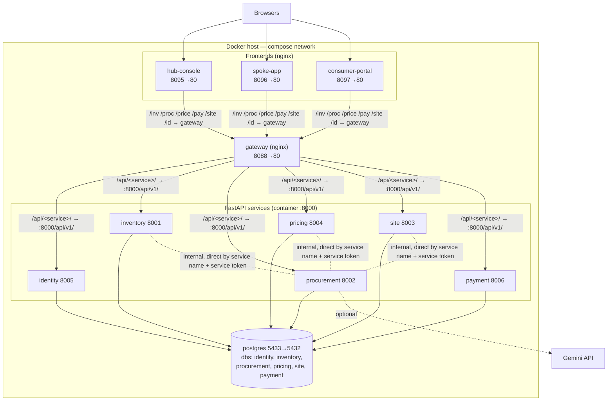

# Consmat AI V1 — System-Level Design (SLD)

> **Status:** 🟢 As-built · **Version:** 1.1 · **Orchestration:** Docker Compose (`infra/docker-compose.yml`)

The deployment landscape as it actually runs: containers, ports, networking, persistence, configuration,
integrations, and operations. See [HLD.md](./HLD.md) for architecture and [LLD.md](./LLD.md) for internals.

---

## 1. Deployment Topology

**11 containers** on the Compose default bridge network, from one compose file. One PostgreSQL, six
FastAPI services, one nginx gateway, three nginx-served SPAs. The **JIT dispatch scheduler** (D20) runs
as a background thread **inside** the site-service container — not a separate container.



---

## 2. Container Inventory

| Container | Image/build | Host→Container | Depends on |
|-----------|-------------|----------------|------------|
| consmat-v1-db | postgres:16-alpine | 5433→5432 | — |
| consmat-v1-identity | ./services/identity-service | 8005→8000 | db |
| consmat-v1-inventory | ./services/inventory-service | 8001→8000 | db |
| consmat-v1-procurement | ./services/procurement-service | 8002→8000 | db, inventory |
| consmat-v1-pricing | ./services/pricing-service | 8004→8000 | db, inventory |
| consmat-v1-site | ./services/site-service | 8003→8000 | db, inventory |
| consmat-v1-payment | ./services/payment-service | 8006→8000 | db |
| consmat-v1-gateway | ./gateway | 8088→80 | all 6 services |
| consmat-v1-hub-console | ./apps/hub-console | 8095→80 | gateway |
| consmat-v1-spoke-app | ./apps/spoke-app | 8096→80 | gateway |
| consmat-v1-consumer-portal | ./apps/consumer-portal | 8097→80 | gateway |

All services: `python:3.11-slim`, healthcheck `GET /health`, `restart: unless-stopped`. Frontends/gateway:
multi-stage node→`nginx:1.27-alpine`. Ports are overridable via `${*_PORT}` env.

> Gateway host port is **8088** (8080 is taken by CVAT on the dev machine).

---

## 3. Networking & Routing

Three hops, all same-origin from the browser's perspective (no CORS needed for the apps):

```
browser → app nginx (static + /xxx proxy) → gateway (/api/<service>/) → service (/api/v1/)
```

- **App nginx** proxies path prefixes to the gateway, e.g. hub-console `/inv/* → gateway/api/inventory/*`, `/id/* → gateway/api/identity/*`, etc.
- **Gateway** maps `/api/<service>/* → http://<service>:8000/api/v1/*` for identity/inventory/procurement/site/pricing/payment; adds central CORS; serves `/` (route index) and `/health`.
- **Internal service-to-service** calls do **not** go through the gateway — they hit the target directly by compose service name (`http://inventory-service:8000`, `http://pricing-service:8000`) with a minted `service` JWT.
- **External/programmatic clients** can call the gateway directly (`http://localhost:8088/api/...`) with CORS.

---

## 4. Persistence

- **One PostgreSQL 16** container; **database per service** (identity, inventory, procurement, pricing, site, payment) on the same server (D10).
- Each service **self-provisions** on start: `ensure_db` creates its database if absent → `alembic upgrade head` → seed (`entrypoint.sh`). No shared-volume init ordering needed.
- Volume `pgdata`; wipe with `docker compose … down -v` (each service re-provisions + re-seeds on next start → clean seed state).
- Seeded data: materials + `per_sqft` + **15 branded products** (inventory), vendors + **product prices** (procurement), margin rules (pricing), 9 phases + demo spoke/consumer/coverage (site), demo users incl. **`ops@`** (identity). **Stock and orders are not seeded** — inventory starts empty; receiving a PO populates brand stock.

---

## 5. Environment Configuration

Compose substitution reads **`infra/.env`** (gitignored). A committed **`infra/.env.example`** documents it.

| Variable | Purpose |
|----------|---------|
| `JWT_SECRET` | Shared HS256 secret — every service must agree |
| `DEMO_PASSWORD` | Seeded demo-user password (`consmat123`) |
| `AI_PROVIDER` / `AI_API_KEY` / `AI_MODEL` / `AI_BASE_URL` | Hub LLM (procurement); **gemini + gemini-flash-lite-latest** |
| `SCOUT_PROVIDER` / `SCOUT_API_KEY` | External price-scout (procurement): `auto`/`tavily`/`web`/`llm`/`stub` + the search-provider key (e.g. Tavily) |
| `SCHEDULER_ENABLED` / `SCHEDULER_INTERVAL_SECONDS` | site-service JIT scheduler thread (default on, 60s) |
| `RAZORPAY_* / STRIPE_* / PAYU_* / CASHFREE_*` | Payment secrets (only if config.yaml selects that provider) |
| `*_PORT` | Host port overrides |

Per-service env (in compose): `DATABASE_URL`, `API_PREFIX`, `JWT_SECRET`, plus `INVENTORY_URL`/`PRICING_URL`
for internal calls, `AI_*` + `SCOUT_*` for procurement, and `SCHEDULER_*` for site.

---

## 6. External Integrations

| Integration | Status | Notes |
|-------------|--------|-------|
| **Gemini LLM** | **Live** | Procurement advice; `gemini-flash-lite-latest`; free-tier quota; deterministic fallback |
| **Tavily web search** | **Optional (live)** | External price-scout when `SCOUT_API_KEY` set (`SCOUT_PROVIDER=auto/tavily`); Gemini Google-Search grounding (`web`) and model estimates (`llm`) are the fallbacks; all offers advisory |
| **Payment gateway** | **Mock (active)** | `payment-service/config.yaml` `provider: mock` (settles instantly); razorpay/stripe/payu/cashfree are extension points reading env secrets |
| **Notifications** | **In-app (active)** | JIT scheduler writes `notifications` rows surfaced in hub-console Projects + spoke SiteDetail; email/push is a future extension |
| **OSRM / maps** | Not present in v1 | (was a V0 concept; not carried over) |

---

## 7. Security

| Area | As-built | Production note |
|------|----------|-----------------|
| Auth | JWT (HS256) issued by identity, validated per service; role guards | Rotate `JWT_SECRET`; short-lived tokens |
| Secrets | `infra/.env` (gitignored); provider keys by env-var name from config.yaml | Use a secrets manager |
| CORS | Central at the gateway | Restrict origins for prod |
| Transport | Plain HTTP locally | Terminate TLS at the gateway/ingress |
| Passwords | bcrypt | Enforce policy on real signups |
| Payments | Mock; no real charge | Wire provider with webhook signature verification |

---

## 8. Build & Run

```bash
docker compose -f infra/docker-compose.yml up -d --build
```

| Component | URL |
|-----------|-----|
| hub-console | http://localhost:8095 |
| spoke-app | http://localhost:8096 |
| consumer-portal | http://localhost:8097 |
| API gateway | http://localhost:8088 (`/`, `/health`, `/api/...`) |
| identity / inventory / procurement / site / pricing / payment | :8005 / :8001 / :8002 / :8003 / :8004 / :8006 (`/docs` each) |

Demo logins (password `consmat123`): `manager@` `supervisor@` `ops@` (hub) · `spoke@` `architect@`
`civil@` (spoke) · `demo@` (consumer) · `admin@` `vendor@`. Tear down: `down` (add `-v` to wipe data →
clean seed state on next `up`).

**Enable/verify the Hub LLM:** put a Gemini key on `AI_API_KEY=` in `infra/.env`, then
`docker compose -f infra/docker-compose.yml up -d procurement-service`; check
`GET /api/procurement/procurement/llm-status` (via gateway) → `live: true`.

---

## 9. Observability

- Each service: `GET /health` (drives the Docker healthcheck) and Swagger at `/docs`.
- Gateway: `GET /health` and `/` route index.
- Hub LLM: `/procurement/llm-status`; LLM errors logged as `[hub-llm] ERROR …`; web scout failures as `[price-scout] …`.
- JIT scheduler: logs `[scheduler] …` on startup and whenever a tick takes action; `POST /site/scheduler/tick` runs one pass on demand.
- Logs: `docker compose -f infra/docker-compose.yml logs -f <service>`.

---

## 10. Scaling & Limitations

- **Database-per-service** already isolates state, but all databases share one Postgres instance — split to separate instances/clusters to scale independently.
- **Single hub** simplifies v1; multi-hub would add hub routing to procurement/inventory.
- Services are individually replicable behind the gateway once their Postgres is externalized.
- The gateway is a single ingress (and a single point of failure) — run it replicated behind a load balancer for HA.
- Internal calls are synchronous REST; event-driven flows (e.g. phase triggers) are a future option.
- The JIT scheduler is an in-process thread in site-service; running >1 site-service replica would double-fire ticks — extract it to a singleton worker (or add leader election) before scaling that service horizontally.

---

*Related: [HLD.md](./HLD.md) · [LLD.md](./LLD.md) · [DECISIONS.md](./DECISIONS.md)*
