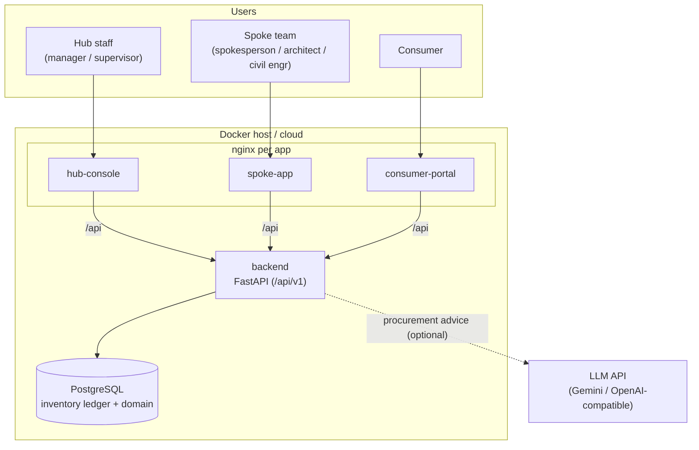

# Consmat AI V1 — System-Level Design (SLD)

> **Status:** 🟡 Design phase · **Version:** 0.1 · This describes the **target** deployment landscape for
> V1. Components are built step by step (see [HLD roadmap](./HLD.md#15-build-roadmap)); nothing here is
> deployed yet.

For architecture see [HLD.md](./HLD.md); for the domain model see [LLD.md](./LLD.md).

---

## 1. Scope

V1 introduces a key change from V0: because the hub must track **every inbound/outbound inventory
movement**, the system moves from an in-memory store to a **persistent database**. The target landscape
is a backend service, a persistent DB, an LLM provider (procurement advice), and three role-specific
frontends.

---

## 2. Target Deployment Landscape

---

## 3. Service Inventory (target)

| Service | Role | Notes |
|---------|------|-------|
| `backend` | FastAPI API (`/api/v1`) | Modular monolith to start; service split TBD |
| `db` | PostgreSQL | Durable inventory ledger + domain; **new in V1** |
| `hub-console` | React SPA (nginx) | Manager + supervisor operations |
| `spoke-app` | React SPA (nginx) | Spokesperson + architect + civil engineer |
| `consumer-portal` | React SPA (nginx) | Consumer status/orders (V1 scope TBD) |

Frontends serve static assets and reverse-proxy `/api` to the backend (same-origin), as in V0.

---

## 4. Persistence (new in V1)

- **PostgreSQL** holds domain entities and the **append-only inventory ledger** ([LLD §5](./LLD.md#5-inventory--ledger)).
- Requirements: transactional reserve/deduct (no oversell), auditable movements, migrations.
- Seed/reference data (materials, phases, initial vendors) loaded via migration/seed scripts.
- Connection via `DATABASE_URL`; schema migrations via a tool (Alembic or equivalent) — TBD.

---

## 5. Environment Configuration (planned)

| Variable | Purpose |
|----------|---------|
| `BACKEND_PORT`, `HUB_PORT`, `SPOKE_PORT`, `CONSUMER_PORT` | Host ports |
| `DATABASE_URL` | PostgreSQL DSN (required in V1) |
| `JWT_SECRET` | Auth signing secret |
| `AI_PROVIDER`, `AI_API_KEY`, `AI_MODEL`, `AI_BASE_URL` | Procurement LLM (pluggable; `stub` disables) |
| `PAYMENT_*`, `NOTIFY_API_KEY`, `OSRM_URL` | Optional integrations (stubbed initially) |

Secrets live only in `.env` (gitignored). A committed `.env.example` documents the variables.

---

## 6. External Integrations

| Integration | Status in V1 | Notes |
|-------------|--------------|-------|
| **Procurement LLM** | Planned/active | Advice only; deterministic fallback; free-tier quota caveats carry from V0 |
| **Payment** | Stubbed | Adapter interface; consumer billing later |
| **Logistics (hub→site)** | Basic first | Distance/ETA like V0; OSRM optional later |
| **Notifications** | Off | Phase/dispatch alerts to spoke/consumer later |

---

## 7. Networking & Security

- Same-origin frontends (nginx proxies `/api` → backend); CORS locked in non-local environments.
- JWT bearer auth; role-scoped guards ([LLD §4](./LLD.md#4-roles--permissions)).
- TLS terminated at ingress in production; secrets via environment, never committed.

---

## 8. Build & Run (to be defined)

Deployment scripts (`docker-compose.yml`, Dockerfiles) are added under `infra/` and each app directory
as those steps are implemented. This section is a placeholder until the backend + DB land.

---

## 9. Migration from V0

V1 is a clean rebuild, not an in-place migration. Reusable assets from V0:
- Domain math (BOM coefficients, distance/logistics, cheapest-vendor selection → hub procurement).
- The pluggable LLM provider abstraction (`AI_PROVIDER` + base-URL resolution).
- Docker/nginx packaging patterns.

Not carried over: the buyer-centric marketplace flows, the in-memory store, and the vendor-direct
checkout.

---

*Related: [HLD.md](./HLD.md) · [LLD.md](./LLD.md) · [DECISIONS.md](./DECISIONS.md)*
